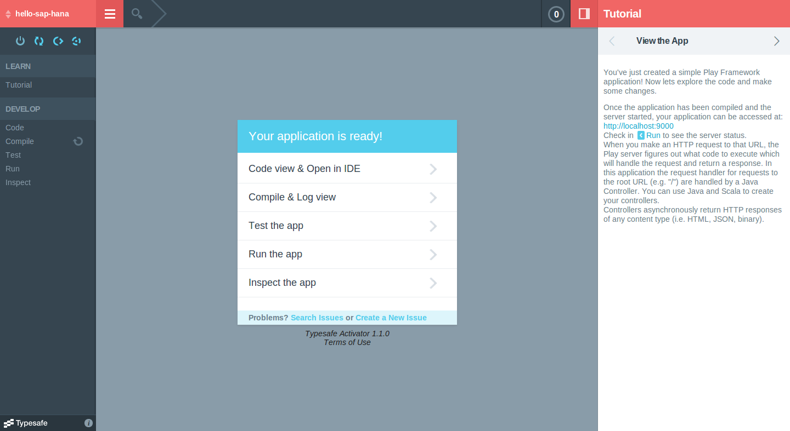
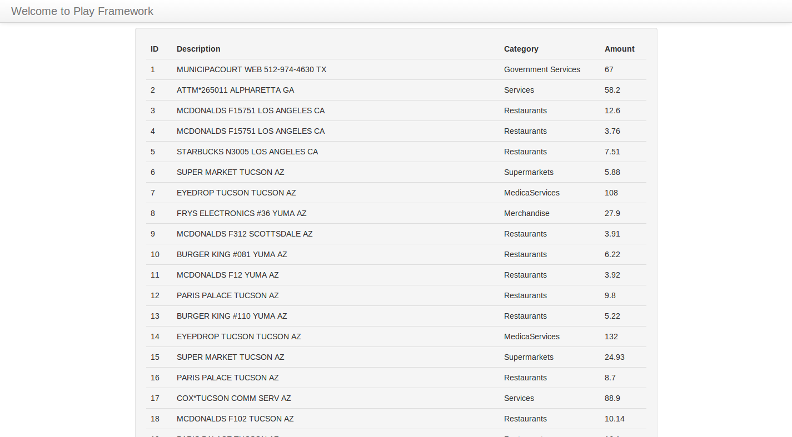

# Building Modern Apps with JSON Services and JavaScript UIs using SAP HANA DB & Play Framework

The SAP HANA database is a robust cloud database that can easily be combined with [Play Framework](http://www.playframework) to build modern apps.  Today applications UIs are moving to the client-side via JavaScript and mobile clients.  This change requires back-ends to produce structured data instead of HTML markup.  The de-facto standard method of exposing back-end data is through RESTful style JSON services.  In browser UIs are now being built with JavaScript running on the client using frameworks like AngularJS.  Combining a JavaScript UI and RESTful JSON services built with Play Framework & Scala along with the SAP HANA database provides a modern architecture that scales and provides dramatically improved productivity.  This article will walk you through the steps to setup your SAP HANA & Play Framework environments and then build a simple JSON service and JavaScript UI.

## Setup Your Environment

1. Create a [SAP HANA Developer Edition on Amazon Web Services](http://scn.sap.com/docs/DOC-28294)
2. Download and install [Typesafe Activator](http://typesafe.com/platform/getstarted)
2. Download and install [SAP HANA Client Developer Edition](https://hanadeveditionsapicl.hana.ondemand.com/hanadevedition/)

## Create a New Application

1. Launch Activator and search for the `hello-play-scala` template
2. Create a new application using that template

You should now see the Activator UI for your new application:

## Connect to the HANA DB

In the Activator UI, open *Code* and then navigate to the `conf/application.conf` file and add the follow lines (replacing the values with the ones for your environment:

    db.default.driver=com.sap.db.jdbc.Driver
    db.default.url="jdbc:sap://12.23.45.67:30015/HDB"
    db.default.user=SYSTEM
    db.default.password=Passw0rd

From the SAP HANA Client Developer Edition, copy the `hdbclient/ngdbc.jar` file into a new `lib` directory in the root of your new Play project.

In Activator open *Run* and click *Restart* and now your running Play application should be connected to your SAP HANA database.  Open your Play application in a new browser tab and verify that it runs correctly: [http://localhost:9000](http://localhost:9000)  (Note: If there were any problems connecting to your database you will see those errors in your browser.)

## Build the RESTful JSON service

For this example app we will use the out-of-the box sample PSA (Personal Spend Analysis) data which includes a table containing some transactions.

Create a new directory and file named `app/models/Transaction.scala` containing:

    package models
    
    import java.util.Date
    import java.math.BigDecimal
    
    import anorm._
    import anorm.SqlParser._
    import play.api.libs.json.Json
    
    
    case class Transaction(id: Int, amount: Double, tranDate: Date, postDate: Date, description: String, category: String)
    
    object Transaction {
    
      val rowParser = {
        get[Int]("ID") ~
        get[BigDecimal]("AMOUNT") ~
        get[Date]("TRAN_DATE") ~
        get[Date]("POST_DATE") ~
        get[String]("DESCRIPTION") ~
        get[String]("CATEGORY_TEXT") map { case id~amount~tranDate~postDate~description~category => 
          Transaction(id, amount.doubleValue(), tranDate, postDate, description, category)
        }
      }
      
      implicit val jsonWrites = Json.writes[Transaction]
      
    }

This contains a value object named `Transaction` that will hold the data we get back from the database.  There is also a `rowParser` that creates a mapping from a JDBC row to the `Transaction` value object.  The `jsonWrites` creates a way to serialize a `Transaction` to JSON data.  Refresh the [http://localhost:9000](http://localhost:9000) page in your browser to make sure there aren't any errors with your new code.

Create a new web controller method that will fetch the transactions from the database.  In Activator edit the `app/controllers/Application.scala` file and add the following inside the `Application` object:

      def psaTransactions = Action {
        import anorm._
        import play.api.db.DB
        import play.api.Play.current
        import play.api.libs.json.Json
        import models.Transaction
    
        DB.withConnection { implicit c =>
          val result = SQL("""SELECT * FROM "PSA"."psa.data::psa_transaction.Details"""").as(Transaction.rowParser.*)
          Ok(Json.toJson(result))
        }
      }

This new controller method does a select on the `psa_transaction.Details` table and gets all the rows and columns out.  It then uses the `Transaction.rowParser` to convert each row into a `Transaction` value object.  The `result` is a list of each `Transaction` from the database.  Finally the result is converted to JSON and returned in the HTTP response.

To map this new controller method to an HTTP URL edit the `conf/routes` file and add the following line:

    GET        /psa-transactions     controllers.Application.psaTransactions()

This will tell Play that an HTTP `GET` request to `psa-transactions` is handled by the `controllers.Application.psaTransactions()` method you just created.  Try it in your browser by navigating to: [http://localhost:9000/psa-transactions](http://localhost:9000/psa-transactions)

## Build the JavaScript UI

For simplicity we will use CoffeeScript (which compiles to JavaScript) and jQuery to fetch the JSON data via Ajax and then render the data in a pretty table using [Bootstrap](http://getbootstrap.com) for the CSS styling.

Create a new directory and file named `app/assets/javascripts/index.coffee` containing:

    $ ->
      $.get "/psa-transactions", (data) ->
        t = $("<table>").addClass("table")
        thr = $("<tr>")
        thr.append($("<th>").text("ID"))
        thr.append($("<th>").text("Description"))
        thr.append($("<th>").text("Category"))
        thr.append($("<th>").text("Amount"))
        t.append($("<thead>").append(thr))
        $.each data, (index, item) ->
          row = $("<tr>")
          row.append($("<td>").text(item.id))
          row.append($("<td>").text(item.description))
          row.append($("<td>").text(item.category))
          row.append($("<td>").text(item.amount))
          t.append(row)
        $(".well").children().replaceWith(t)

(Note: Be careful with the indentation since CoffeeScript uses significant spacing to indicate code blocks.)

This CoffeeScript makes a `GET` request to `/psa-transactions` when the web page loads and then iterates through all the JSON data and constructs a new table containing the data, and then finally adds it to the web page.

To run the JavaScript that is compiled from this source edit the `app/views/index.scala.html` and add the following right above the `
` line:

    

Now when you open your browser to [http://localhost:9000](http://localhost:9000) the request will be made for the JSON data and then once it returns you should see a nice table containing the transactions from the HANA DB in a table.  It sound look like:

## Further Learning

Congratulations!  You've created a modern application that uses Play Framework, Scala, CoffeeScript, and jQuery for a JSON service and JavaScript UI along with connecting to a SAP HANA cloud database.  To learn more about Play Framework check out the [documentation](http://www.playframework.com/documentation/2.2.x/Home) and explore the other Play template in Activator.